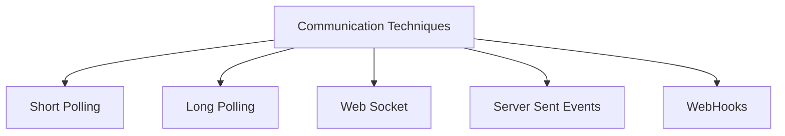
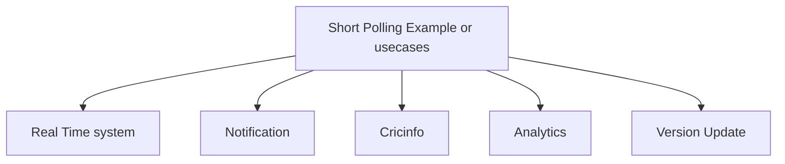
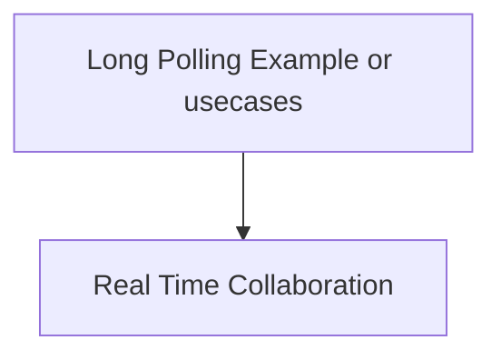
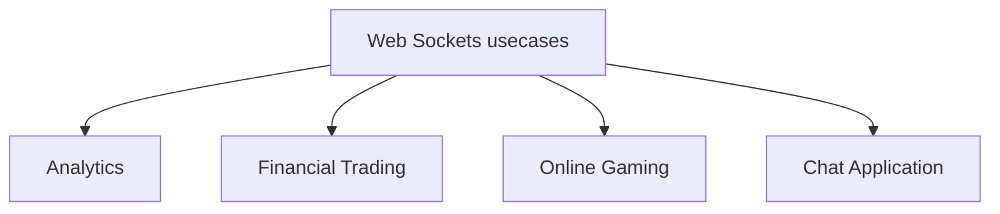
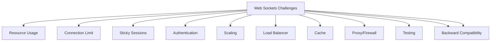
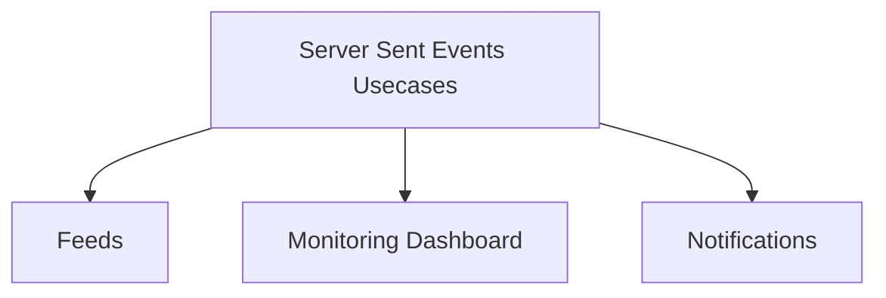
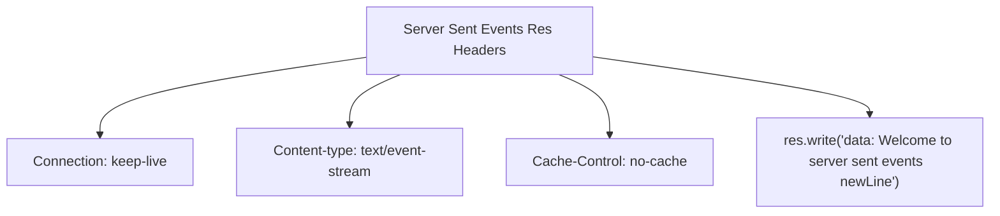
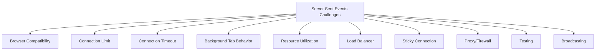
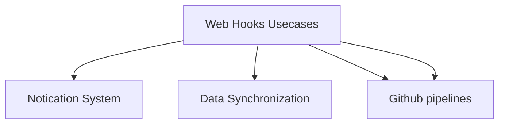

Communication Techniques

 
__________________________________________________________________________________________________________
 

 
__________________________________________________________________________________________________________
 

 
__________________________________________________________________________________________________________
 

 
__________________________________________________________________________________________________________
 

 
__________________________________________________________________________________________________________
 

 
__________________________________________________________________________________________________________
 
 
 
 

| Short Polling  | Long Polling | Web Socket  | Server Sent Events | WebHooks |
| ------------- | ------------- | ------------- | ------------- | ------------- |
| Short Live Connection  | Single Long lived connection | Full Duplex Communication | Long Live unidirectional communication | Real Time Communication |
| No Persistent Connection  | Connection is open untill you get new data/ timeout  | Single Long live TCP Connection | Single HTTP connection | Event Driven |
| Less Resource Utility  | Cons: Large number of connection will increase the load  | Continuous Bi-Directional Communication | - | Post Rest API (payload, Authorization Secret) |
| Problem With Scale | -  | - | - | Retry Mechanism |
| - | - | - | - | Verification/Acknowledgement |
